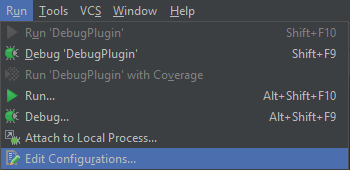
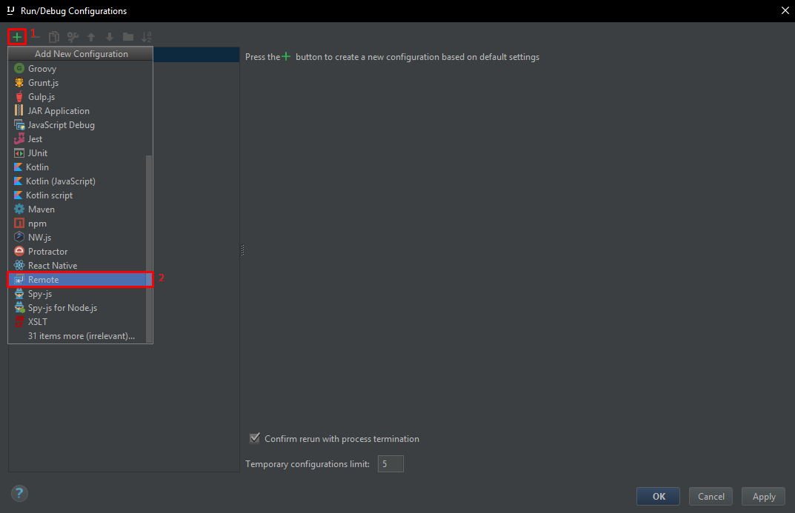
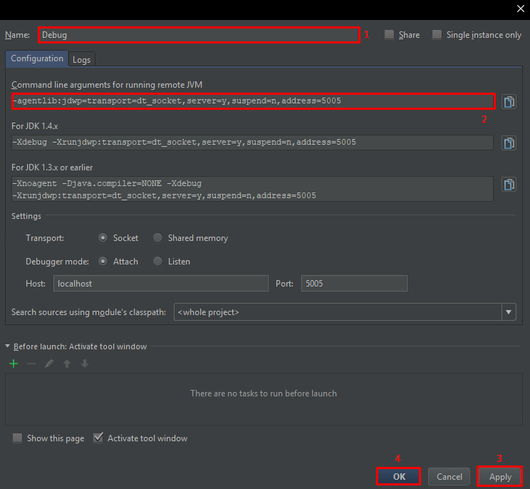
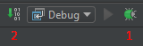
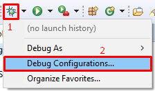
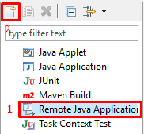
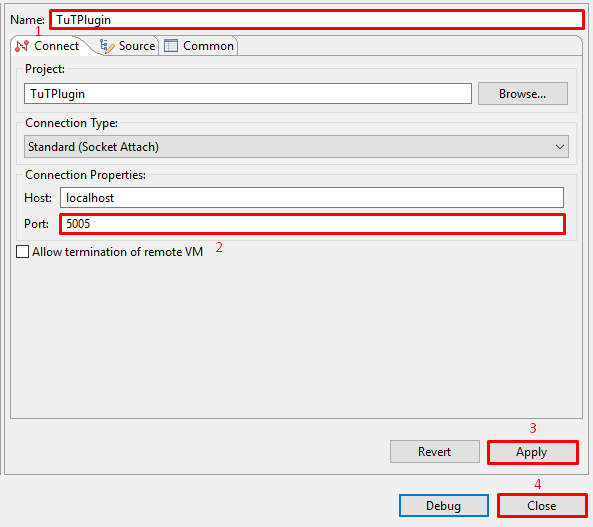

## Отладка плагина в Intellij IDEA

Данная статья писалась с использованием Intellij IDEA 2017.1.1!

Перейдём через меню навигации в меню настройки запуска `run -> Edit Configurations`.

В открывшемся окне нажимаем на `+`, в выпадающем списке выбираем `Remote`.

Называем нашу конфигурацию `Debug` или как захотите сами и теперь нам надо скопировать всё из поля `Command line arguments for running remote JVM`. Нажимаем `Apply` и затем `Ok`.

Скопированный ранее код теперь нужно изменить на такой:

`java -Xmx2G -Xms2G -agentlib:jdwp=transport=dt_socket,server=y,suspend=n,address=5005 -jar Spigot.jar`

Теперь перейдём в папку с нашим Spigot сервером и создадим там файл `start.bat` и в него пропишем наш изменённый код. Запускаем наш сервер и затем нажимаем на кнопку `Debug` в Intellij IDEA. Теперь после каждого изменения нужно будет нажимать кнопку `Build`.

 

## Отладка плагина в Eclipse

Данная статья писалась с использованием Eclipse Neon.3 Release (4.6.3)!

Перейдём через меню навигации в меню настройки отладки `debug -> Debug Configurations...`.

В открывшемся окне выбираем `Remote Java Application` и нажимаем на `New launch configuration`.

Создастся новая конфигурация, вписываем в поле `Name` название конфигурации (может быть любым). В поле `Port` вводим порт **5005**, нажимаем на `Apply` и `Close`.

Теперь перейдём к настройки сервера. Для отладки нужно прописать:

`java -Xmx2G -Xms2G -Xdebug -Xnoagent -Djava.compiler=NONE -Xrunjdwp:transport=dt_socket,server=y,suspend=n,address=5005 -jar Spigot.jar`

Запускаем сервер и включаем режим `Debug`.
