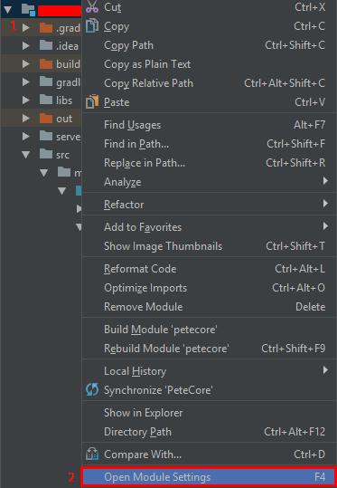
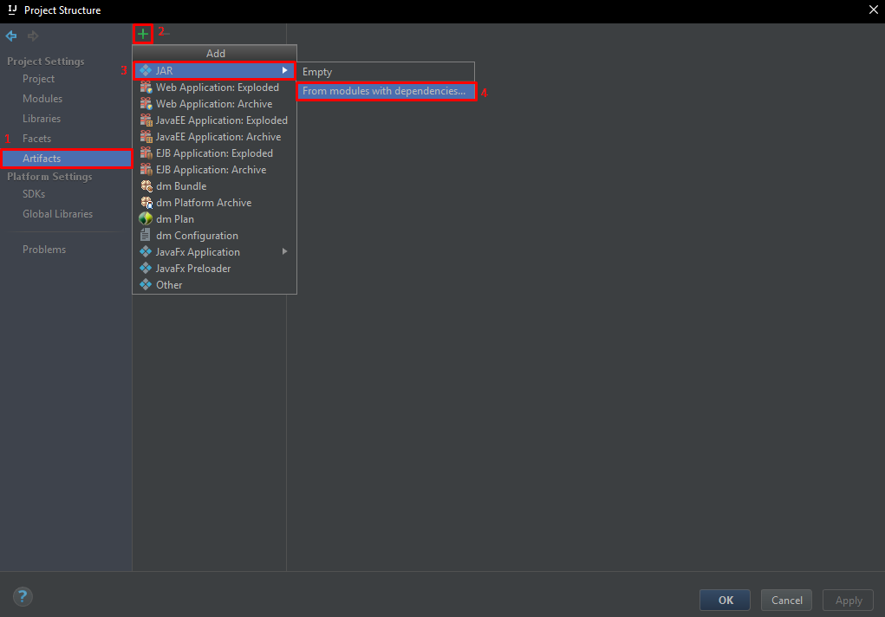
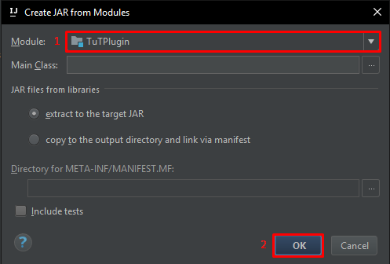
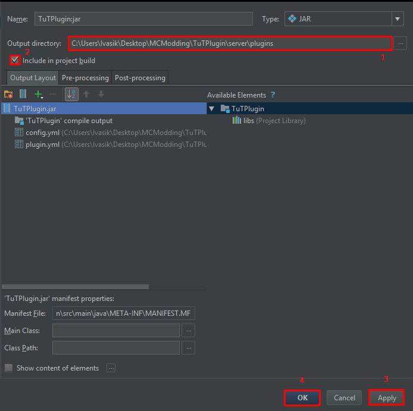
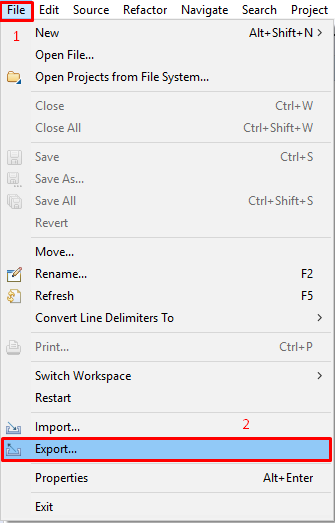
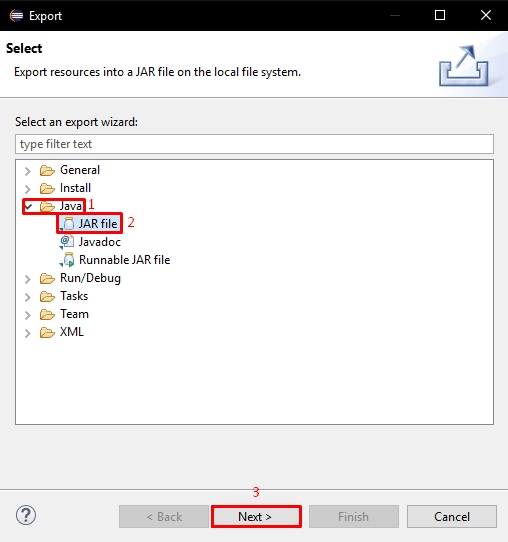
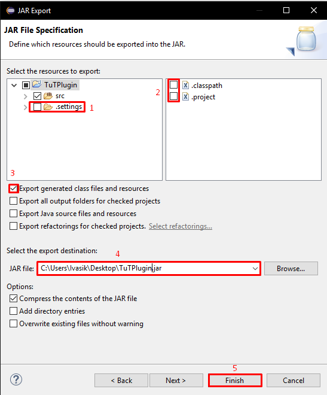

## Экспорт плагина в jar - Intellij IDEA

Наш плагин готов, но как же его собрать? Build? Но он же только в папку собирает!
Решение есть, нажимаем F4 или кликаем по проекту ПКМ и выбираем `Open Module Settings`.

В открывшемся окне выбираем раздел `Artifacts` и нажимаем на `+`. В выпадающем меню выбираем `JAR -> From modules with dependencies...`.

В открывшемся окне выбираем наш проект и нажимаем на `Ok`.

Теперь перейдём к настройке. Зададим путь, вы можете выбрать другую папку куда будет сохранён плагин. На данный момент путь указывается для папки `plugins` в папке с сервером, чтобы можно было провести отладку мода. Далее ставим галочку напротив `Include in project build`, чтобы нам было достаточно нажать на кнопку `build`. Нажимаем на `Apply`, а затем `Ok`. Настройка завершена!

## Экспорт плагина в jar - Eclipse

Наш плагин готов, но как же его собрать? Build? Но он же только в папку собирает!
Решение есть, в меню навигации выбираем `File -> Export...`.

В открывшемся окне выбираем `Java -> JAR File` и нажимаем `Next`

Далее убираем галочку с `.settings`, `.classpath`, `.project` (Нам ведь не нужен лишний мусор). Ставим галочку напротив `Export generated class files and resources`, в поле `JAR file` выбираем путь куда будет сохранён наш плагин и задаём название плагина. Нажимаем кнопку `Finish`.

