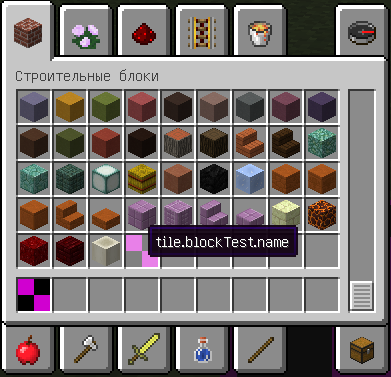
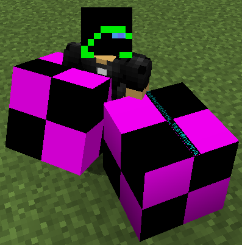
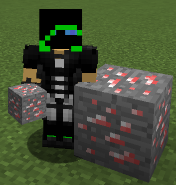

# Создание блока

Для начала в пакете мода создадим пакет block. Таким образом всё, что связано с блоками нашего мода, будет находиться в этом пакете.

## Класс блока

Теперь нам нужен файл, в котором мы будем объявлять и регистрировать все предметы. Можно конечно делать это в CommonProxy, но
если у нас в моде будут предметы, блоки, мобы и т.д., то очень скоро файл разрастется и работать с ним будет очень трудно.

Создадим в пакете block файл Blocks.java (или ModBlocks.java). Название может быть любым. В классе создадим два метода:

* registerBlocks - для регистрации блоков на клиенте и сервере.
* registerBlocksRender - для регистрации рендера блоков на клиенте.

```java
package ru.mcmodding.testmod.block;

public class Blocks
{
    public static void registerBlocks()
    {

    }

    public static void registerBlocksRender()
    {

    }
}
```

Теперь перейдём в CommonProxy и в метод `preInit` добавим вызов метода `registerBlocks`:

```java
// CommonProxy.java

public void preInit(FMLPreInitializationEvent e)
{
    Blocks.registerBlocks();
}
```

А регистрацию рендера добавим в метод `init` в файле ClientProxy:

```java
// ClientProxy.java

@Override
public void init(FMLInitializationEvent e)
{
    super.init(e);

    Blocks.registerBlocksRender();
}
```

Заметьте, что сначала мы регистрируем блоки (в `preInit`), а только потом назначаем рендер (в `init`).

## Файл блока

Теперь пора создать файл самого блока.

В Minecraft применяется следующий способ именования блоков: `Block...`.
Если наш блок называется `Test`, то название файла будет `BlockTest.java`.

Создадим файл `BlockTest.java`, который наследует класс `Block`.

```java
package ru.mcmodding.testmod.block;

public class BlockTest extends Block
{
    public BlockTest()
    {
        super(Material.WOOD);
        this.setRegistryName("block_test");
        this.setUnlocalizedName("blockTest");
        this.setCreativeTab(CreativeTabs.BUILDING_BLOCKS);
    }
}
```

Разберем код конструктора:

`super(Material.WOOD);` — задаёт материал блока. **Суперкласс для блоков обязателен!**

`this.setRegistryName("block_test");` — установка уникального имени нашего блока. **Не используйте буквы в верхнем регистре!**
Только английские маленькие буквы, цифры и нижние подчеркивания!

`this.setUnlocalizedName("blockTest");` — установка имени предмета для последующей локализации. Можно использовать буквы в верхнем регистре.

`this.setCreativeTab(CreativeTabs.BUILDING_BLOCKS);` — добавление нашего предмета во вкладку "Строительные Блоки" в креативе.

## Регистрация блока

Если вы сейчас запустите Minecraft, то не увидите никакого блока. Нужно сообщить Forge, что мы добавляем в игру новый блок.

Для этого перейдем в класс блоков и добавим новую переменную в тело класса:

```java
public static BlockTest BLOCKTEST = new BlockTest();
```

Теперь зарегистрируем наш блок в игре с помощь метода `registerBlocks`:

```java
public static void registerBlocks()
{
    GameRegistry.register(BLOCKTEST);
    GameRegistry.register(new ItemBlock(BLOCKTEST).setRegistryName(BLOCKTEST.getRegistryName()));
}
```

Теперь игра знает о нашем блоке. Можете запустить клиент и найти во вкладке "Блоки" созданный блок.





## Модель и текстура блока

В классе `Blocks` в методе `registerBlocksRender()` впишите:

```java
public static void registerItemsRender() {
    Minecraft.getMinecraft().getRenderItem().getItemModelMesher().register(BLOCKTEST, 0, new ModelResourceLocation(BLOCKTEST.getRegistryName(), "inventory"));
}
```

С помощью этого кода мы зарегистрировали модель для нашего блока. Теперь эту модель необходимо создать.

Создаём файл `block_test.json` по пути `resources/assets/testmod/blockstates/`. Имя этого файла должно **полностью** совпадать со значением, которое мы указали в строке `this.setRegistryName("block_test");`. Для блока без статов самое простое содержимое этого файла должно быть следующим:

```json
{
    "variants": {
        "normal": { "model": "testmod:block_test" }
    }
}
```

Создадим файл `block_test.json` по пути `resources/assets/testmod/models/block/` и такой же в `resources/assets/testmod/models/item/`.
Имя этого файла
должно **полностью** совпадать со значением, которое вы указали в строке `this.setRegistryName("block_test");`. Для самого простого
блока содержимое этого файла должно быть следующим:

```json
{
    "parent": "block/cube_all",
    "textures": {
        "all": "testmod:blocks/block_test"
    }
}
```

Здесь параметр `parent` указывает, откуда унаследовать параметры отображения модели. Массив текстур `textures` указывает
пути к текстурам. Базовая текстура указывается через параметр `all`, значение которого указывает путь к текстуре.

Обратите внимание, что путь выглядит следующим образом: `testmod:blocks/block_test`. Первая часть этой строчки `testmod` должна
равняться modid вашего мода. Затем идет путь. В данном случае текстура с именем `block_test.png` должна лежать по следующему пути:

`resources/assets/testmod/textures/blocks/`


Название файла — `block_test.png` — должно быть таким же, какое значение было указано в методе `this.setRegistryName("block_test");`.


