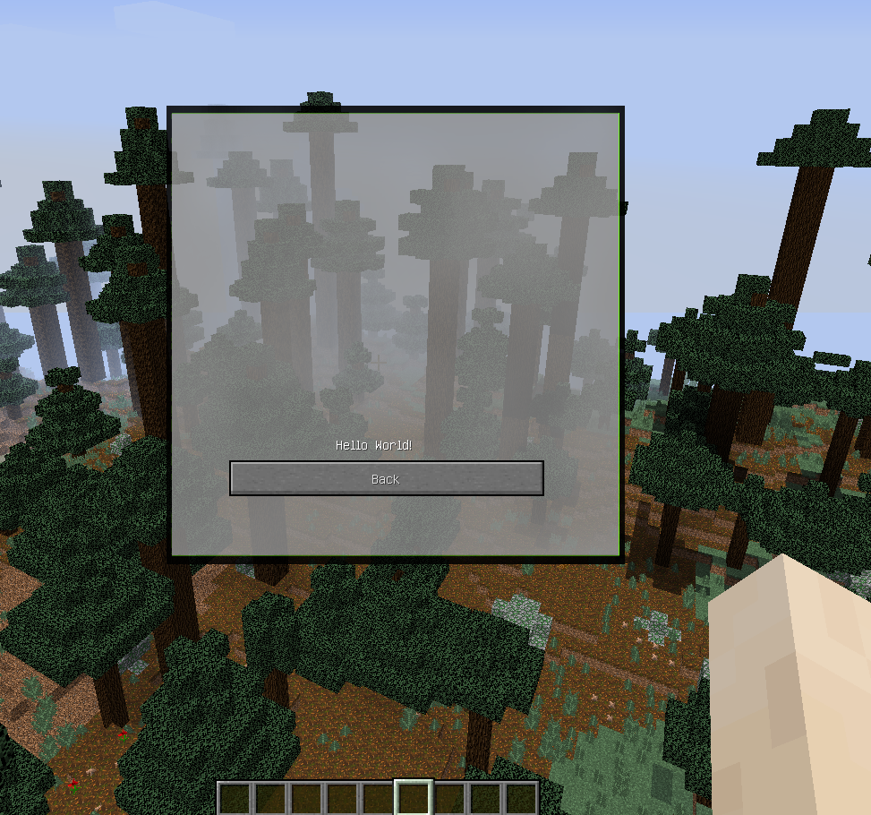

### Создание простой Gui
В жизни любого коддера возникает потребность в создании своего GUI(Graphical User Interface), вот этим мы и займемся.

Для начала необходимо создать класс для Gui и наследовать для него класс `GuiScreen`
```java
public class GuiName extends GuiScreen{
  int xSize = 176;
  int ySize = 166;
}
```
``xSize и ySize`` - константы, которые можно изменять под себя.

Теперь начинаем его заполнять базовыми элементами:

-Рисуем кнопки
```java
public void initGui(){
		this.buttonList.clear();
		this.buttonList.add(new GuiButton(0, (this.width - this.xSize) / 2 + 5, this.height / 2  + 55, 176, 20, I18n.format("Back", new Object[0])));
	}
```
Где:
`0` - это id кнопки, на которое мы вешаем действие.

`(this.width - this.xSize) / 2 + 5` - X координата.

`this.height / 2  + 55` - Y координата.

`176` - Ширина кнопки

`20` - Высота кнопки

`I18n.format("Back", new Object[0])` - То,что minecraft будет нам подставлять в локализованном виде(или то,что напишем мы.)

-Задаём им действие
```java
	public void actionPerformed(GuiButton g){
		switch (g.id){ //На самом деле можно и через if/else if
			case 0:	this.mc.displayGuiScreen(null);//Закрываем Гуи
		}
	}
```

-Отрисовываем весь экран
```java
public void drawScreen(int mouseX, int mouseY, float partialTicks){
		int x = (this.width - this.xSize) / 2;
		int y = (this.height - this.ySize) / 2;
		GL11.glColor4f(1.0F, 1.0F, 1.0F, 1.0F);
		GL11.glDisable(2896);
		super.mc.renderEngine.bindTexture(new ResourceLocation(Main.MODID + ":textures/gui/backGui.png")); //Достаём нашу текстурку
		this.drawTexturedModalRect(x -30, y - 60, 0, 0, this.xSize +80, this.ySize+90); //Рисуем её в нужном месте
		drawString(this.mc.fontRenderer, "Hello World!", x+ 65, y+125, 16777215);//Рисуем текст в гуи
		super.drawScreen(mouseX, mouseY, partialTicks);
	}
```
В `this.drawTexturedModalRect` параметры задаются основываясь на ваш задний фон

Если понадобилось отобразить это-же Гуи(т.е. обновить) - вешаем на кнопку: 
```java
this.mc.displayGuiScreen(this);
```
Открытие самой гуи из любого(почти) участка кода(Нарпимер через бинд на кнопку):
```java
Minecraft.getMinecraft().displayGuiScreen(new GuiName());
```
