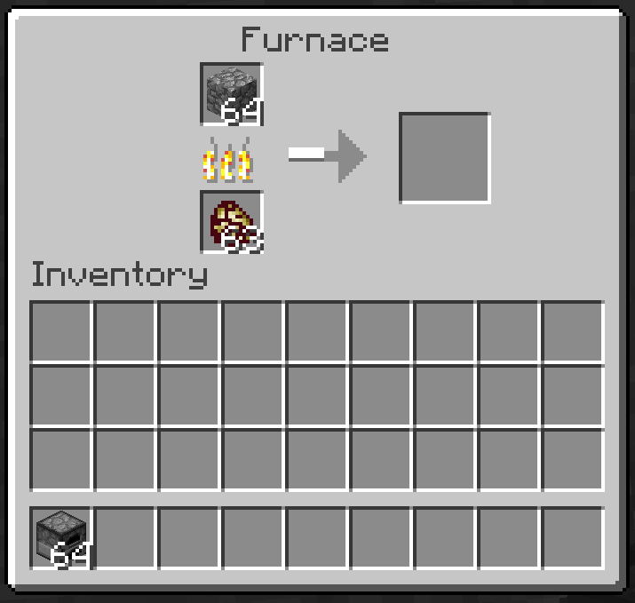
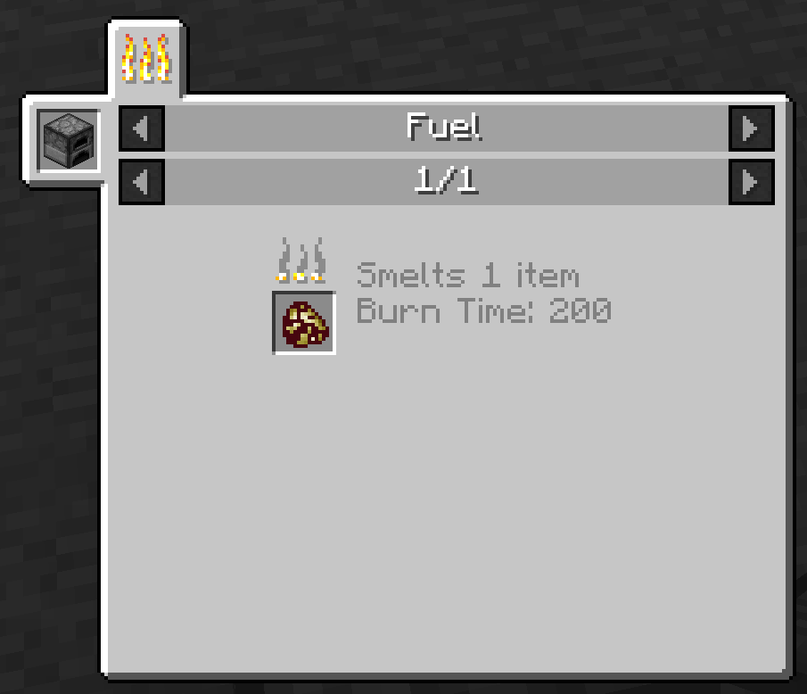

# Предмет с временем горения

Автор статьи — [Doc](https://forum.mcmodding.ru/members/doc.7271/).

Рабочий тестовый мод с материалами данной статьи можно скачать [здесь](images/customfuel.rar).

Данный мини-ресурс дает возможность добавить свой предмет как вид топлива для печки или механизма, который использует `TileEntityFurnace#getItemBurnTime`.
Почти вся основная информация расписана в самом коде.
Как минимум нужно знать как зарегистрировать эвент/предмет/блок!

Начнем.

Для добавления времени топлива к предмету есть 2 разных варианта.
Разберем все 2.

## Вариант 1
Изменение через эвент получения времени горения.
Хоть в 1.7 этот метод считается Deprecated, но этот метод нормально работает, как и должен.
```java
@SubscribeEvent
public void event(FuelBurnTimeEvent e) { // Сам эвент получения топлива.
    if (e.fuel.getItem() == Items.apple) { // Проверяем, что нужный нам предмет.
        e.burnTime = 200;  // Устанавливаем время горения.
        e.setResult(Result.ALLOW); // ОБЯЗАТЕЛЬНО изменяем результат эвента. Можно и DENY, главное что бы он был не DEFAUL.
    }
}
```

## Вариант 2
Изменение через унаследование IFuelHandler.
Для данного метода нужно создать класс, который будет наследован от IFuelHandler, так же его нужно регистрировать.
Класс:
```java
public class FuelHandler implements IFuelHandler { // Унаследование от обработчика времени топлива.

    @Override
    public int getBurnTime(ItemStack fuel) { // Сюда передается сам предмет, который проверяется на горение.
        if (fuel.getItem() == Items.apple) // Проверка на наш предмет.
            return 200; // Установка времени горения.
        return 0;
    }
}
```
И сама регистарция.
Она должна быть в инициализации мода. (`FMLInitializationEvent`)

```java
GameRegistry.registerFuelHandler(new FuelHandler()); // Регистрация самого обработчика времени топлива.
```

Так же для удаления подходит вариант 1. (Вариант 2 работает только на добавление!)

```java
@SubscribeEvent
public void event(FuelBurnTimeEvent e) { // Сам эвент получения топлива.
    if (e.fuel.getItem() == Items.coal) { // Проверяем, что нужный нам предмет.
        e.burnTime = 0; // Устанавливаем время горения.
        e.setResult(Result.ALLOW); // ОБЯЗАТЕЛЬНО изменяем результат эвента. Можно и DENY, главное что бы он был не DEFAUL.
    }
}
```

## Блок
Для добавление блоку время горения нужно заменить:
`if (fuel.getItem() == TMRegistry.itemWithFuel)`
На
`if (fuel.getItem() == Item.getItemFromBlock(BLOCK))`
В место BLOCK указать Ваш блок.
Если делать через вариант 1, то переопределять метод нужно у ItemBlock'а блока.

## Итог
Для проверки можно просто попробовать "запустить" печку или же использовать JEI:



